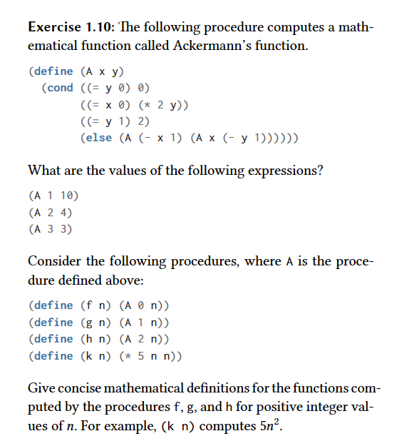
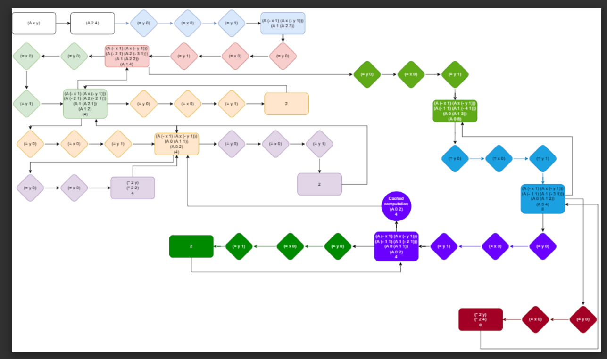

### Answer

I noticed the following points about this function after I calculated some results by hand:
- (A 0 n) -> 2n for n > 0. n = 0 -> 0.
- (A 1 n) -> 2^n for n > 1. n = 0 -> 0. n = 1 -> 2 
- (A 2 n) -> (^ 2 (A 2 (- n 1))) for n > 1. n = 0 -> 0. n = 1 -> 2

I will leave the draft I made to try to understand the patterns of the function:


Here, some notes after I drew the draft above:

```
  When we have (A x→1 y) we can understand it as 2^y unless when y is 0, then we get 0

  (A 2 2) gives us 16
    - (A 1 (A 2 1))
        - 4
    - (A 1 4)
        - 16

  (A 2 3) gives us 65536
    - (A 1 (A 2 2))
    - (A 1 16) → 65536

  (A 0 n) → n * 2
  (A 1 n) → 2^n
  (A 2 n) → (2^(A 2 n - 1))
```