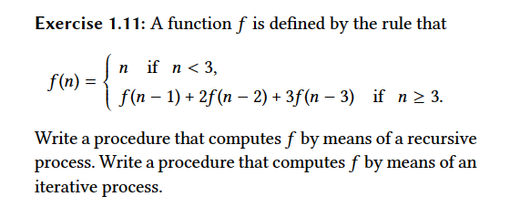

### Question

### Explanation
That was a difficult one for me!

After I thought for some time, I realized that Lisp way of dealing with iterative processes has its analogous ways of achieving the same in other languages usually using for, while, do while, and things alike.

So, I thought like: what are the things we need when dealing with the looping structures?

The answer in mind was:
- We need something that counts a variable up or down, or some mechanism similar to that to update a variable after each iteration. This variable is used so that we know when to stop the iteration.
- In every iteration we need to have the required context of values so that we may depend solely in a single call instead of depending on the call stack to deal with a recursive process. So, we need to maintain the current context of computations in some way
- So, I thought how could I turn the recursive process implementation into the iterative process. I figured out I would use a counter up to n because I realized if I would count n down 0 I would basically be doing the same thing that the recursive process implementation was doing.
- For the context of values I realized that the first three values are always going to compute 0, 1 and 2, respectively, so for the first calls we would make we already had the values we would need to the weird formula in the function
- Then, it was just a metter of understanding from where my count should begin and when it should end. It started as 3 because the first three computations were pre-made by my function as 0, 1 and 2
