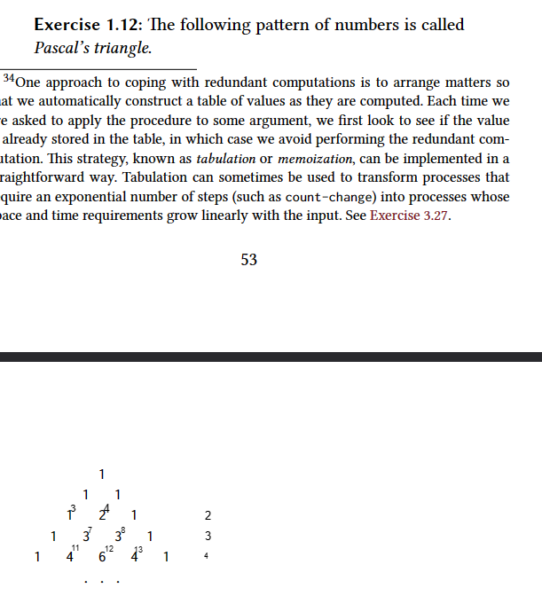
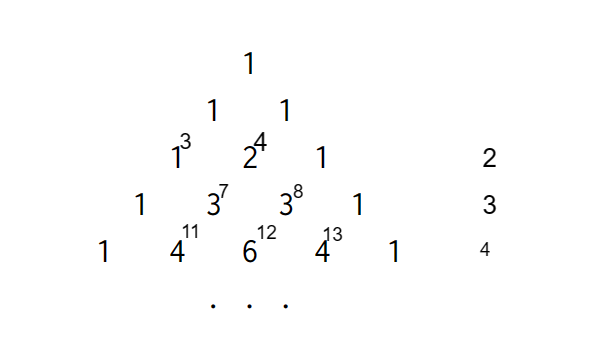

#### Notes

- The number of 1's is _depth + 1_
- The number of elements for each layer is equal to the number of the layer itself. Layer 2 will have 2 elements. Layer 7 will have 7 elements and so on...
- We are basically dealing with a tree
- Every node will have two child nodes, one to the left the other to right, except for leaf nodes and
- Every node, except for the root node and nodes at edges, will have two parents, one to the left, the other to the right.
- The value of each node is given by the following sum: _(+ left-parent right-parent)_
- I can work with a list of values to represent each node.
- The positions of the parent is going to be given by the position of _current node - depth_ and _current node - depth + 1_
- We will set the value of a node to be the value of an edge when the following condition is true: (_current_node - depth) + (_current_node - depth + 1) = 2
- For the first two layers (root and the subsequent layer) we can either have them hard-coded into our function or add an extra condition to the previous condition described above that if the result is 1 it is also considered an edge.
- I can use the absolute value to calculate what I mentioned above and it is going to work even for the root node. abs (- 0 1) = 1 -> 1; abs (- 1 2) = 1 -> 1;
- I noticed that I need to add another case that is if the result is 0 I also need to consider the node as an edge.
- I will use lexical scoping to keep the list of values that I need to calculate the positions of each node.
- I will need to know the value of the curreny later so that I know when stop in the last edge. I also need to keep track of much elements I have in the current layer. It can facilitate the way I calculate the edges
- At the end I decided to work with positions of the layer and the layer element in my recursive procedure. I decided to work with positions starting from 0 instead of 1.
- Because of the decisions I mentioned above, I saw that the math formula I had written before to get the value of the current node would not work. So, I started analyzing the pascal triangle and seeing how I could adapt the previous formula to the new structure of the algorithm. I came up with the following formula after some time: _(+ (- length layer) (- length layer 1)). In the image below I show some drafts I made while reading to make sure the formula was right
