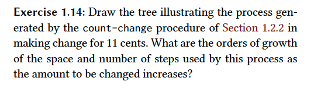

### Answer
As the algorithm makes two calls in every iteration. It makes 2^n calls. One call is branched into two calls, that can be branched into 4 calls.

So, it is an exponential algorithm

### Notes
- Translating the algorithm into a more simple sentence, the way it works is like the following: 
  - count-change calls cc with an initial value for kinds-of-coins of 5 (that represents 50)
  - the logic of cc is: I will calculate the number of ways that the change can be calculated using this kind of coin (second part of the else) + the number of ways that the change can be calculated using a lower kind of coin, e.g., 50 -> 25
  - as cc calls itself recursively it builds a tree and when it is built up you have all of the ways you can count the change
  - if amount is 0 at some point then it means that you have managed to change the amount in that current tree
  - if amount is less than 0 then it mean that the current tree cannot change the amount
  - if the kind of coin is 0 then it means there are no more kinds of coins to to dillute even more. As the algorithm is called recursively it would be a way to create new sub-trees using smaller kinds of coins, but it would stop here.
