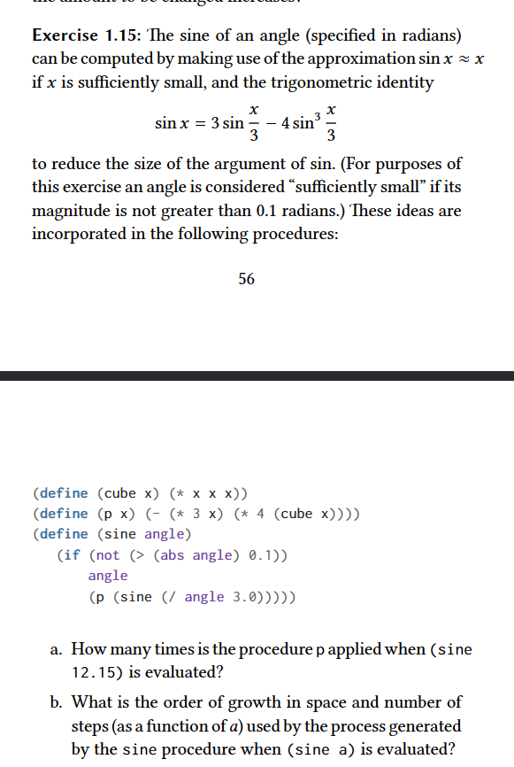
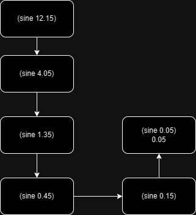

### Answer
a) It is applied 4 times as we can see in the diagram below

Effectively, p is going to be called sine's calls - 1 times.

b) Both, space and time complexities have order of growth of O(log 3 a). It is due to the fact the after each iteration a is being divided by a constant factor 3.
