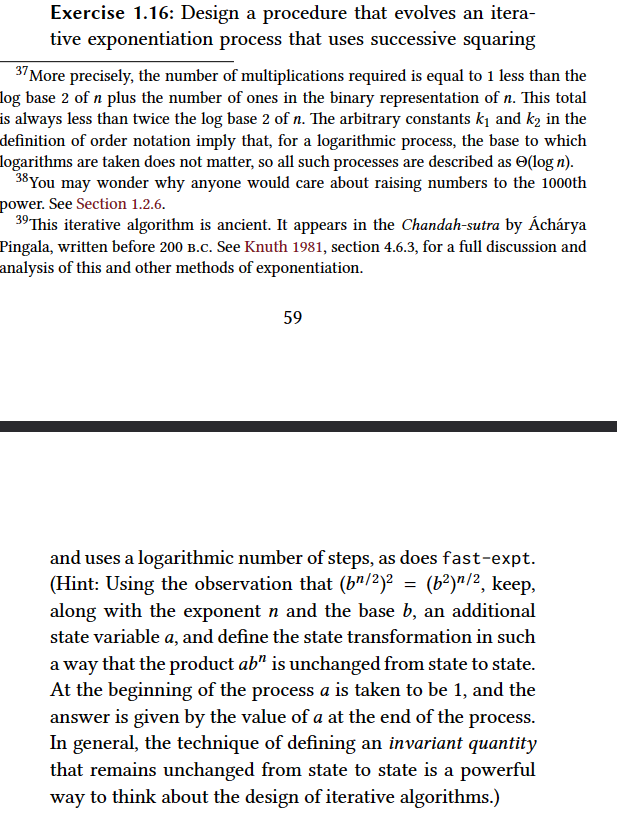

### Answer
- I did it slightly differently from what was asked in the question
- I did not understand the reason for the existence of the a variable, so I did not include it
- My algorithm seems to be logarithmic and iterative.