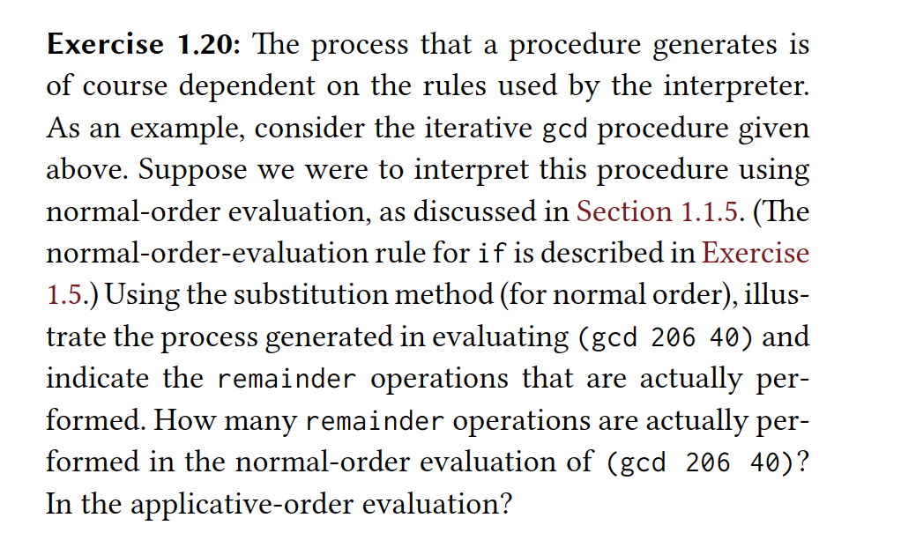
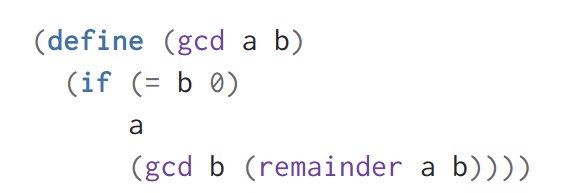
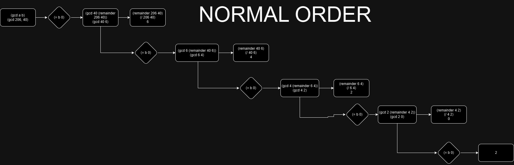

### Answer
- By using normal order the number of calls will be approximately log n - 1 operations
- By using applicative order we will have log n operations.
- Normal order will have 1 less reaminder operation because at the end when (= b 0) is evaluated to true, then the next gcd procedure call is not going to be evaluated and the extra remainder operation is not going to as well.
- Applicative order will evaluate all the calls even though they might not be used.

I tried to show how normal-order evaluation would work in a way that does not correspond to an interpreter exactly (an interpreter would make things way more complicated to read because they would evaluate the remainder operations only when the if was evaluated and they would have some duplications for the operations) but it is possible to grasp the core idea
