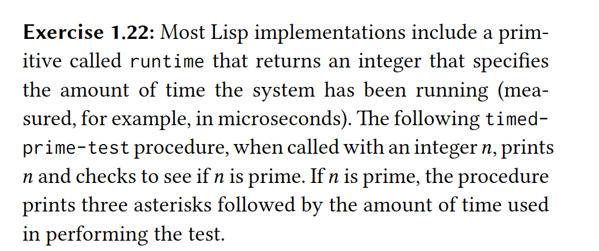
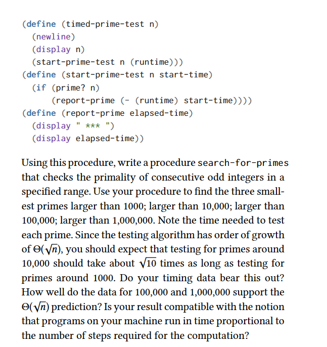

### Answer
- I copy/pasted the part that was already present in the book and created the search-for-primes procedure which basically calls timed-prime-test for odd integers in a specified range only
- In order to get only the first three numbers I created a separate shell script because I thought adding this specific use case to the program would break the SRP. So I just created a simple abstraction that integrates with the program and does what it is needed.
- There is a problem on the integration I created between the shell script and the scheme program relating to the way the pipe is being terminated by the shell script, I will not look into this for time management and priorization purposes.
- Since Racket works mostly with milliseconds I used the currenct-inexact-milliseconds procedure multiplied by 1000000 to get the amount of nanoseconds it took to run the procedures

The results as asked in the book were: (results measured in nanoseconds)
```
Three first smallest primes larger than 1000
1009 *** 3328.0
1013 *** 3072.0
1019 *** 3584.0

Three first smallest primes larger than 10000
10007 *** 3840.0
10009 *** 3840.0
10037 *** 3840.0

Three first smallest primes larger than 100000
100003 *** 4096.0
100019 *** 4352.0
100043 *** 4096.0

Three first smallest primes larger than 1000000
1000003 *** 5632.0
1000033 *** 5120.0
1000037 *** 5376.0
```
-----
Since the testing algorithm has order of growth of Θ(square root n), you should expect that testing for primes around 10,000 should take about square root 10 times as long as testing for primes around 1000. Do your timing data bear this out?

Answer: No, the distance from the calculation of one series of primes to another is something around [0, 1.5] (microseconds)

-----

How well do the data for 100,000 and 1,000,000 support the Θ(square root n) prediction?

Answer: It does not seem to be square root of 10, it seems to me that it increases 1 microsecond for everytime we multiply n by 10. I could not think of a math relation to describe the behavior. 

----

Is your result compatible with the notion that programs on your machine run in time proportional to the number of steps required for the computation?

Answer: Yes