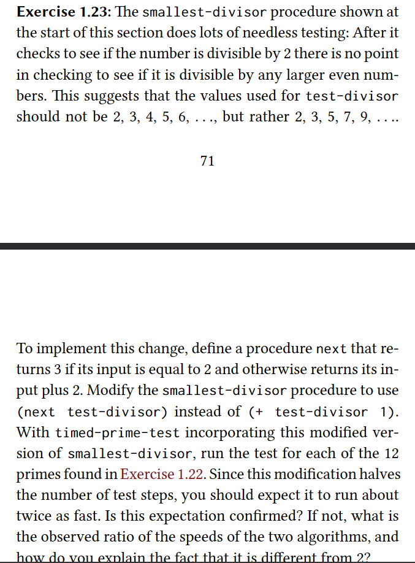

### Answer
Demonstration of the results

New:
```
Time taken: 4864.0
1009

Time taken: 5376.0
1013

Time taken: 5120.0
1019

Time taken: 5888.0
10007

Time taken: 5888.0
10009

Time taken: 5632.0
10037

Time taken: 8192.0
100003

Time taken: 8960.0
100019

Time taken: 8448.0
100043

Time taken: 16640.0
1000003

Time taken: 16384.0
1000033

Time taken: 16384.0
1000037

Time taken: 101120.0
100000081

Time taken: 236032.0
1000000097
```

Old
```
Time taken: 3072.0
1009

Time taken: 4096.0
1013

Time taken: 4352.0
1019

Time taken: 5632.0
10007

Time taken: 5376.0
10009

Time taken: 5632.0
10037

Time taken: 9728.0
100003

Time taken: 9216.0
100019

Time taken: 6144.0
100043

Time taken: 23296.0
1000003

Time taken: 25600.0
1000033

Time taken: 14336.0
1000037

Time taken: 171776.0
100000081

Time taken: 509440.0
1000000097
```

Conclusion:

For smaller numbers it is difficult to see any substantial change in how much each algorithm takes to compute the smallest divisor of a number. As the input increases substantially (like the last number I used: 1000000097) then we start to see the difference between the algorithms which is close to 2x.

I assume that for smaller numbers what really consumes most of the time is events like computing internal stuff of the programming language, waiting for some queues in the CPU, and miscellaneous stuff like that. As the input really gets bigger then the algorithm efficiency starts to have a considerable bearing on the results.