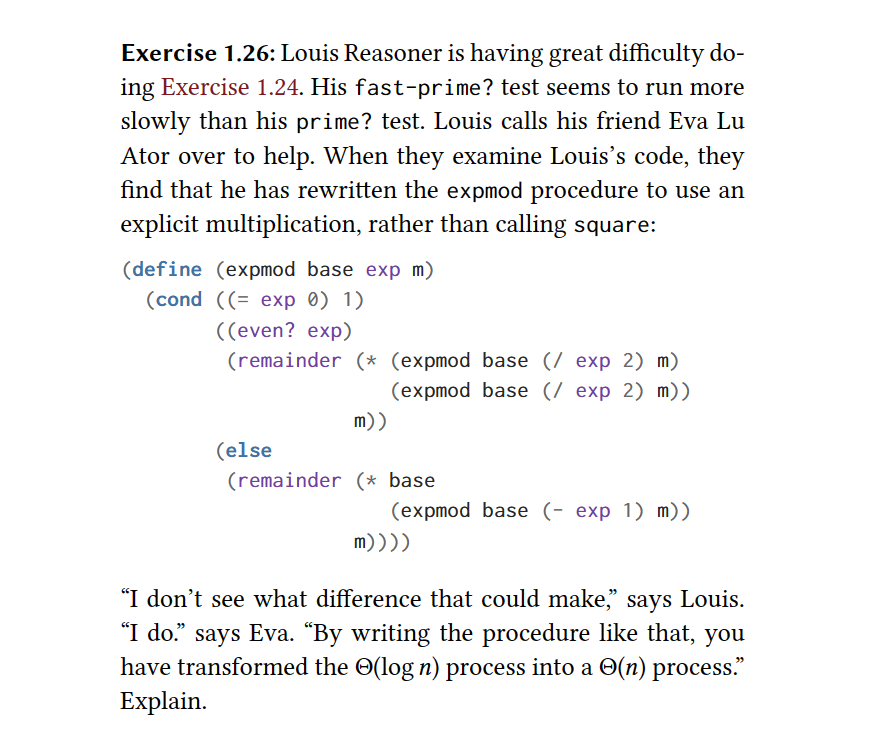

### Question

### Answer
By making such a change he is calling expmod twice. Previously he was calling it once and passing the result as a formal parameter to the square procedure.

Now, he computes it twice and passes the results to the * procedure.

As he computes it twice, expmod has an execution time of O(log n), so log n * log n = n. Therefore the execution time of his function became O(n)

