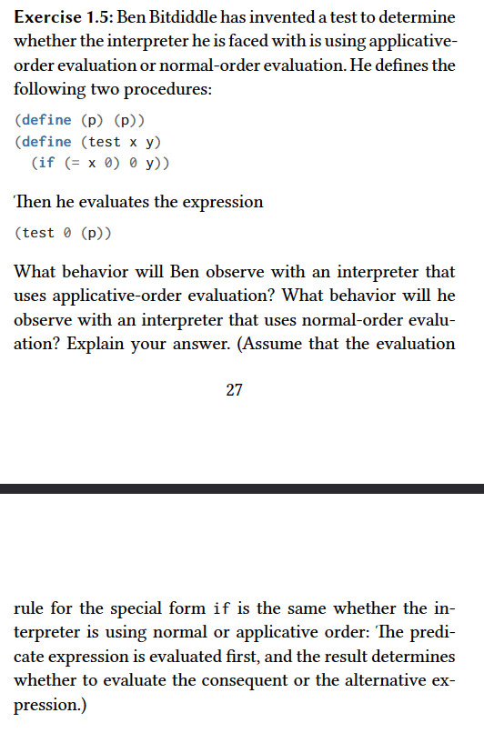

Normal-order evaluation:

If it is using the normal-order evaluation it is going to end in 0

Let's see:

The normal-order evaluation is known for computing the result of an expression only when the expression is needed.

So if we do that for the algorithm shown in the question, here's what we well get
```
  (if (= x 0) 0 (p)) ;;; 1
  (if (= 0 0) 0 (p)) ;;; 2
  (0) ;;; 3. p is never evaluated because it was never needed
```
-----
Applicative-order evaluation:

Now, if it using applicative-order evaluation, it is going to result in an endless loop because applicative-order tries to expand its arguments before executing a procedure and would try to expand p forever.

Let's see that in practice
```
(test 0 (p))
((test 0 (p)) ( ;;; -> it would get stuck when trying to expand p
  ;;; ... code
))
```
