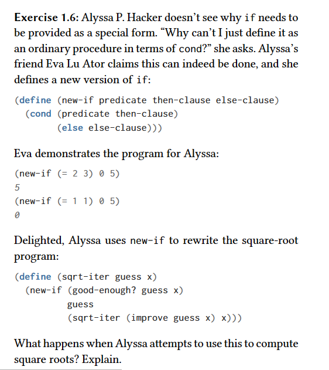

### Answer
If Alyssa doesn't use the special form "if" then she is going to get stuck on and endless loop.
Her "new-if" ordinary procedure computes the value of the else clause even when it would not be necessary. It causes the function to keep calling itself forever preventing the whole idea behind recursion to work which is to have a condition that will prevent things from being executed again

I will demonstrate this behavior in the index.rkt file