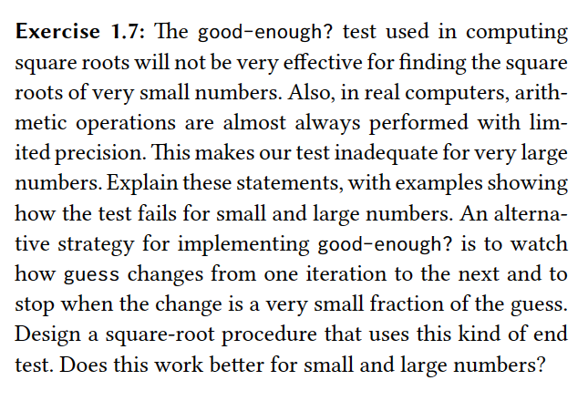

### 1. Answer
The good-enough procedure is going to be very useful for the roots of very small numbers because it will always evaluate to true since the guesses will have changed less than 0.0001 from one another.

An example is:
- 0.000000000000000000000059984343334
- 0.00000000000000000000005

The two numbers when given as input to the sqrt procedure will evaluate to the same result: 0.001953125

### 2. Answer
When working with large numbers we have the issue of real computers performing arithmetic operations with limited operations. Take the two numbers below:
- 5000000000000000011000
- 5000000000000000000000

When inputing these numbers in the sqrt function both of them are going to evaluate to the same result: 70710678118.65475

### 3. Answer
The implementation of the new good-enough? predicate procedure is present in the new.rkt file.

It doesn't seem to work neither better nor worse than the previous approach.

In the left results for the old version and in the right, the new version:
- (sqrt 9) -> 3.0 and 3.0
- (sqrt 16) -> 4.000000000000051 and 4.000000000000051
- (sqrt 121) -> 11.0 and 11.0
- (sqrt 10000) -> 100.0 and 100.0

After making some tests, the new approach seems to work better on the edges, i.e., very large or very small numbers. See the examples below: (left is the old, right is the new)
- (sqrt 0.00000000000051 -> 7.651663766696989e-6 and 7.141428429102563e-7)
- (sqrt 51000000000000) -> GOT STUCK and 7141428.428542851

From now on, only the new version was able to evaluate the expression:
- (sqrt 5100000000000000) -> 71414284.28544095
- (sqrt 0.5000000501051051000000003) -> 0.7071068166170036

Comparison between the performance of the two approaches
- The old version doesn't work well for very large numbers. Either you define a very small threshold for the difference between the square root of the guess and x and experience some problems with even larger numbers trying to hit this difference or you are going to get a wrong result by a great order of magnitude.
- The old version doesn't work well for very small numbers because the way the difference is being calculated will yield undesired results for the nature of working with very small numbers. If you set the difference threshold to a very small value then you are going to experience problems with very large numbers because you will make lots and lots of calculations until you hit the threshold, and that's goind to consume a lot of your processing power.
- The reason for why the new version works so well is that we have figured out to say, "hmm, things are changing so little between one iteration and another... maybe it's time to stop" by making the comparison evaluation work against the difference between the guess and the improved guess. Not only did we change the focus of the comparison evaluation but also we get the difference and see what percentage does this difference represent of the guess. By computing the percentage of the difference between guess and improved-guess to guess we are able to see if it was a substantial change not by absolute values like 0.0001 but rather by relative values like 10%, 0.1%, and so on.