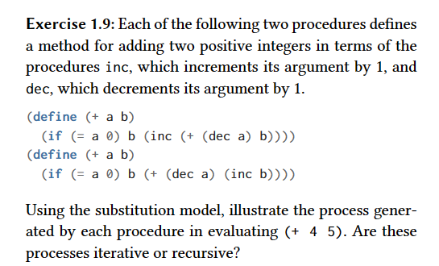
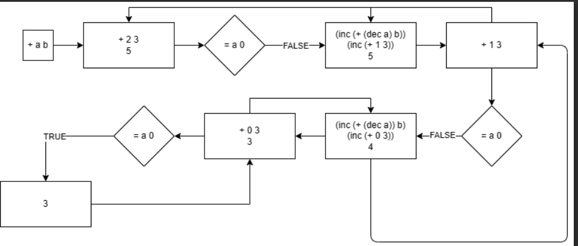
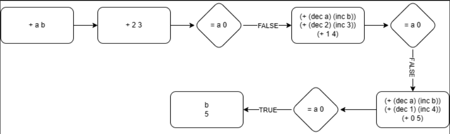

OBS: I used (+ 2 3) instead of (+ 4 5) for lack of attention

### Answer
The first approach is achieving the result through a recursive process kind of recursive procedure, i.e., it needs to maintain the state of the call stack to calculate its final results. See below:

The second approach in the other hand is achieving the result through a iterative process kind of recursive procedure, i.e., it does need to maintain the state of the call stack to calculate its final results, each call has all the data required to achieve the final result. See below:

This happens because in the first approach inc was dependent in the result of (+ (dec a) b) and since the + procedure was recursive, the inc procedure would have its parameter evaluated only after all of the recursive calls were evaluated too, therefore, there is the need for a call stack to be maintained. Therefore, it is a recursive process.

The second approach removes the need of the call stack by inverting the order of the calls. Now inc does not depend on some recursive, neither does dec. The + recursive procedure depends only on its local state and the evaluation of the dec and inc procedures. Therefore, it is an iterative process.