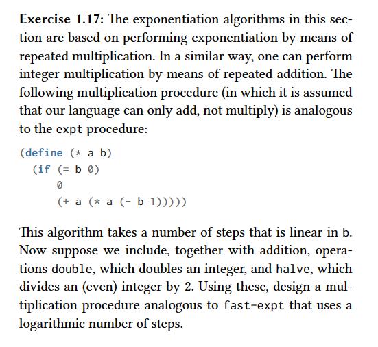

### Answer
- Similar to what I did in exercise 1.16, I have a multiply procedure which calls multiply-iter with the default value for i as 0
- The reason _i_ is 0 as default instead of 1 as in the exercise 1.16 is because there we were dealing with exponentiation and here we are dealing with multiplication.
- This fundamental difference changes the way we interpret identity values. As exponentiation can be treated as repeated multiplication, the identity for multiplication is 1. In constrat, multiplication can be treated as repeated additions and the identity for addition is 0.
- If we had another default value, like 1, for _i_, then the sums to _i_ would be incorrect
- The purpose of _i_ is saving how much we have to add at the end for the operations we skipped when _n_ was odd